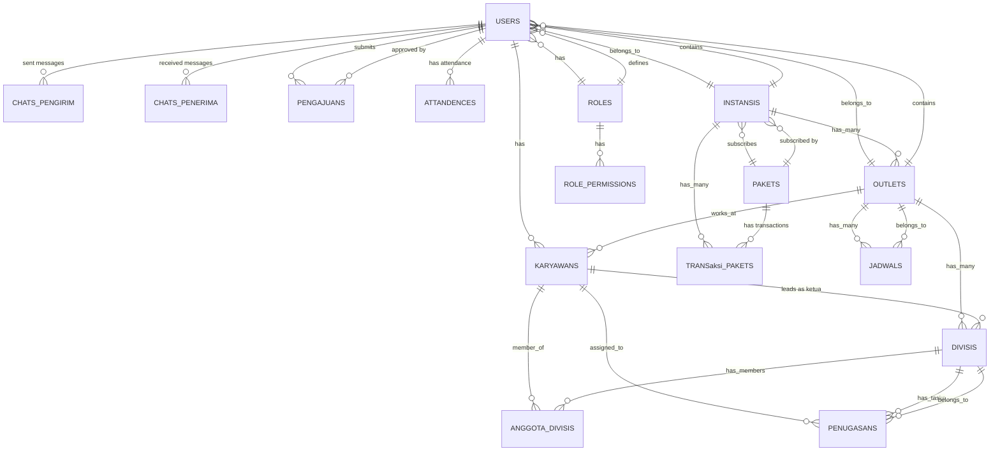

# Entity Relationship Diagram — CodaSuaka

> **Dokumen ini berisi ERD lengkap aplikasi CodaSuaka, mencakup seluruh entitas, relasi, tipe data, serta mapping ke fitur frontend.**

---

## 📊 Diagram Relasi Antar Tabel

---

## 📋 Daftar Entitas & Kolom

### 1. `users` ✅ Sudah Lengkap

| Kolom | Tipe | Keterangan |
|-------|------|------------|
| `id` | bigint AI PK | |
| `name` | varchar(255) | Nama lengkap user |
| `email` | varchar(255) UNIQUE | Email login |
| `email_verified_at` | timestamp NULL | |
| `password` | varchar(255) | Hash password |
| `role_id` | bigint FK → roles.id | NULL = belum punya role |
| `instansi_id` | char(36) FK → instansis.id | NULL = belum punya instansi |
| `outlet_id` | bigint FK → outlets.id | NULL = belum diassign ke outlet |
| `remember_token` | varchar(100) NULL | |
| `timestamps` | created_at, updated_at | |

**Relasi:** `role_id` → [`roles`](#2-roles-), `instansi_id` → [`instansis`](#3-instansis-), `outlet_id` → [`outlets`](#5-outlets-)

---

### 2. `roles` ✅ Sudah Lengkap

| Kolom | Tipe | Keterangan |
|-------|------|------------|
| `id` | bigint AI PK | |
| `nama_role` | varchar(255) | Owner, Kasir, Koki, Pelayan, Kurir, Pencuci, dll |
| `timestamps` | created_at, updated_at | |

**Seeder values:** Owner, Kasir, Koki, Pelayan, Kurir, Pencuci, Admin

---

### 3. `instansis` ✅ Sudah Lengkap

| Kolom | Tipe | Keterangan |
|-------|------|------------|
| `id` | uuid PK | |
| `nama_instansi` | varchar(255) | Nama UMKM / instansi |
| `paket_id` | bigint FK → pakets.id | NULL = free/pending |
| `timestamps` | created_at, updated_at | |

**Relasi:** `paket_id` → [`pakets`](#4-pakets-)

---

### 4. `pakets` ❌ Perlu Dilengkapi

| Kolom | Tipe | Keterangan |
|-------|------|------------|
| `id` | bigint AI PK | |
| **`nama_paket`** | varchar(100) | **BARU:** Nama paket (Basic, Pro, Enterprise) |
| **`harga`** | decimal(15,2) | **BARU:** Harga paket |
| **`deskripsi`** | text NULL | **BARU:** Deskripsi fitur paket |
| **`fitur`** | json NULL | **BARU:** Daftar fitur yg diaktifkan |
| **`durasi_hari`** | int | **BARU:** Masa berlaku dalam hari (30/90/365) |
| **`max_outlet`** | int DEFAULT 1 | **BARU:** Batas maksimal outlet |
| **`max_karyawan_per_outlet`** | int DEFAULT 5 | **BARU:** Batas karyawan per outlet |
| **`is_active`** | boolean DEFAULT true | **BARU:** Status aktif paket |
| `timestamps` | created_at, updated_at | |

---

### 5. `outlets` ❌ Perlu Dilengkapi

| Kolom | Tipe | Keterangan |
|-------|------|------------|
| `id` | bigint AI PK | |
| **`nama_outlet`** | varchar(255) | **BARU:** Nama outlet |
| **`alamat_outlet`** | text | **BARU:** Alamat lengkap outlet |
| **`instansi_id`** | uuid FK → instansis.id | **BARU:** Pemilik outlet |
| **`is_active`** | boolean DEFAULT true | **BARU:** Status aktif |
| `timestamps` | created_at, updated_at | |

**Relasi:** `instansi_id` → [`instansis`](#3-instansis-)

---

### 6. `karyawans` ✅ Sudah Lengkap

| Kolom | Tipe | Keterangan |
|-------|------|------------|
| `id` | uuid PK | |
| `user_id` | bigint FK → users.id | Relasi ke user login |
| `nama_lengkap` | varchar(255) | Nama sesuai KTP |
| `kontak` | varchar(255) NULL | Nomor HP |
| `foto_profil` | varchar(255) NULL | URL foto |
| `alamat` | text NULL | **PERLU DITAMBAH** — alamat karyawan |
| `outlet_id` | bigint FK → outlets.id NULL | **PERLU DITAMBAH** — outlet tempat kerja |
| `sisa_cuti` | int DEFAULT 12 | **PERLU DITAMBAH** — sisa hak cuti |
| `timestamps` | created_at, updated_at | |

**Relasi:** `user_id` → [`users`](#1-users-), `outlet_id` → [`outlets`](#5-outlets-)

> **⚠️ Catatan:** Frontend [`KelolaKaryawanViewModel`](coda-suaka-frontend/app/src/main/java/com/example/codasuaka/ui/screen/kelola_karyawan/KelolaKaryawanViewModel.kt) membutuhkan field `alamat` dan `outlet`.

---

### 7. `attandences` ❌ Perlu Dilengkapi (Presensi / Absensi)

| Kolom | Tipe | Keterangan |
|-------|------|------------|
| `id` | bigint AI PK | |
| **`user_id`** | bigint FK → users.id | **BARU:** User yg absen |
| **`tanggal`** | date | **BARU:** Tanggal absensi |
| **`jam_checkin`** | time NULL | **BARU:** Jam masuk |
| **`jam_checkout`** | time NULL | **BARU:** Jam pulang |
| **`status`** | enum('hadir','terlambat','izin','sakit','alpha') | **BARU:** Status kehadiran |
| **`keterangan`** | text NULL | **BARU:** Catatan tambahan |
| **`lokasi_checkin`** | varchar(255) NULL | **BARU:** GPS / alamat checkin |
| `timestamps` | created_at, updated_at | |

**Relasi:** `user_id` → [`users`](#1-users-)

---

### 8. `transaksi_pakets` ❌ Perlu Dilengkapi

| Kolom | Tipe | Keterangan |
|-------|------|------------|
| `id` | bigint AI PK | |
| **`instansi_id`** | uuid FK → instansis.id | **BARU:** Pembeli paket |
| **`paket_id`** | bigint FK → pakets.id | **BARU:** Paket yg dibeli |
| **`tanggal_mulai`** | date | **BARU:** Tanggal aktif |
| **`tanggal_berakhir`** | date | **BARU:** Tanggal kadaluarsa |
| **`total_harga`** | decimal(15,2) | **BARU:** Jumlah pembayaran |
| **`status`** | enum('active','expired','cancelled') | **BARU:** Status transaksi |
| **`bukti_pembayaran`** | text NULL | **BARU:** URL/Path bukti transfer |
| `timestamps` | created_at, updated_at | |

**Relasi:** `instansi_id` → [`instansis`](#3-instansis-), `paket_id` → [`pakets`](#4-pakets-)

---

### 9. `penugasans` ❌ Perlu Dilengkapi (Tugas Tim)

| Kolom | Tipe | Keterangan |
|-------|------|------------|
| `id` | bigint AI PK | |
| **`judul`** | varchar(255) | **BARU:** Judul tugas |
| **`deskripsi`** | text NULL | **BARU:** Deskripsi detail |
| **`penanggung_jawab_id`** | uuid FK → karyawans.id NULL | **BARU:** Yg bertanggung jawab |
| **`divisi_id`** | bigint FK → divisis.id NULL | **BARU:** Divisi tujuan |
| **`tenggat`** | date NULL | **BARU:** Deadline |
| **`status`** | enum('pending','in_progress','completed','cancelled') DEFAULT 'pending' | **BARU:** Status progres |
| **`created_by`** | bigint FK → users.id | **BARU:** Pembuat tugas |
| `timestamps` | created_at, updated_at | |

**Relasi:** `penanggung_jawab_id` → [`karyawans`](#6-karyawans-), `divisi_id` → [`divisis`](#12-divisis-), `created_by` → [`users`](#1-users-)

---

### 10. `jadwals` ❌ Perlu Dilengkapi (Kalender Event)

| Kolom | Tipe | Keterangan |
|-------|------|------------|
| `id` | bigint AI PK | |
| **`nama_event`** | varchar(255) | **BARU:** Nama event |
| **`deskripsi`** | text NULL | **BARU:** Keterangan event |
| **`tanggal`** | date | **BARU:** Tanggal event |
| **`kategori`** | enum('libur','tugas','event') | **BARU:** Jenis event |
| **`outlet_id`** | bigint FK → outlets.id NULL | **BARU:** Outlet terkait |
| **`created_by`** | bigint FK → users.id | **BARU:** Pembuat event |
| `timestamps` | created_at, updated_at | |

**Relasi:** `outlet_id` → [`outlets`](#5-outlets-), `created_by` → [`users`](#1-users-)

---

### 11. `role_permissions` ❌ Perlu Dilengkapi

| Kolom | Tipe | Keterangan |
|-------|------|------------|
| `id` | bigint AI PK | |
| **`role_id`** | bigint FK → roles.id | **BARU:** Role reference |
| **`permission`** | varchar(100) | **BARU:** Nama permission |
| `timestamps` | created_at, updated_at | |
| **UNIQUE** | (role_id, permission) | Mencegah duplikasi |

**Relasi:** `role_id` → [`roles`](#2-roles-)

---

### 12. `divisis` ✅ Sudah Lengkap

| Kolom | Tipe | Keterangan |
|-------|------|------------|
| `id` | bigint AI PK | |
| `nama_divisi` | varchar(100) | Nama divisi |
| `deskripsi` | text NULL | Keterangan divisi |
| `ketua_karyawan_id` | uuid FK → karyawans.id NULL | Ketua divisi |
| `outlet_id` | bigint FK → outlets.id | Outlet pemilik divisi |
| `timestamps` | created_at, updated_at | |

**Relasi:** `ketua_karyawan_id` → [`karyawans`](#6-karyawans-), `outlet_id` → [`outlets`](#5-outlets-)

---

### 13. `anggota_divisis` ✅ Sudah Lengkap

| Kolom | Tipe | Keterangan |
|-------|------|------------|
| `id` | bigint AI PK | |
| `divisi_id` | bigint FK → divisis.id | |
| `karyawan_id` | uuid FK → karyawans.id | |
| `timestamps` | created_at, updated_at | |
| **UNIQUE** | (divisi_id, karyawan_id) | Cegah duplikasi anggota |

**Relasi:** `divisi_id` → [`divisis`](#12-divisis-), `karyawan_id` → [`karyawans`](#6-karyawans-)

---

### 14. `chats` ✅ Sudah Lengkap

| Kolom | Tipe | Keterangan |
|-------|------|------------|
| `id` | bigint AI PK | |
| `pengirim_id` | bigint FK → users.id | Pengirim pesan |
| `penerima_id` | bigint FK → users.id | Penerima pesan |
| `pesan` | text | Isi pesan |
| `is_read` | boolean DEFAULT false | Status terbaca |
| `timestamps` | created_at, updated_at | |

**Relasi:** `pengirim_id` → [`users`](#1-users-), `penerima_id` → [`users`](#1-users-)

---

### 15. `pengajuans` 🆕 Tabel Baru (Cuti / Izin)

| Kolom | Tipe | Keterangan |
|-------|------|------------|
| `id` | bigint AI PK | |
| `user_id` | bigint FK → users.id | Pembuat pengajuan |
| `jenis` | enum('cuti_tahunan','izin_sakit','mendadak') | Jenis pengajuan |
| `tanggal_mulai` | date | Tanggal mulai cuti/izin |
| `tanggal_selesai` | date | Tanggal selesai cuti/izin |
| `jumlah_hari` | int | Durasi (dihitung otomatis) |
| `keterangan` | text | Alasan pengajuan |
| `status` | enum('pending','disetujui','ditolak') DEFAULT 'pending' | Status approval |
| `disetujui_oleh` | bigint FK → users.id NULL | User yg approve/reject |
| `tanggal_disetujui` | datetime NULL | Waktu approval |
| `timestamps` | created_at, updated_at | |

**Relasi:** `user_id` → [`users`](#1-users-), `disetujui_oleh` → [`users`](#1-users-)

---

## 🔗 Ringkasan Relasi

| # | Entitas 1 | Relasi | Entitas 2 | Keterangan |
|---|-----------|--------|-----------|------------|
| 1 | `users` | N:1 | `roles` | Setiap user punya 1 role |
| 2 | `users` | N:1 | `instansis` | User terdaftar di 1 instansi |
| 3 | `users` | N:1 | `outlets` | User bekerja di 1 outlet |
| 4 | `users` | 1:1 | `karyawans` | Setiap user punya profil karyawan |
| 5 | `users` | 1:N | `chats` (pengirim) | User mengirim banyak pesan |
| 6 | `users` | 1:N | `chats` (penerima) | User menerima banyak pesan |
| 7 | `users` | 1:N | `attandences` | Riwayat absensi user |
| 8 | `users` | 1:N | `pengajuans` | User mengajukan cuti/izin |
| 9 | `instansis` | N:1 | `pakets` | Instansi berlangganan paket |
| 10 | `instansis` | 1:N | `outlets` | Instansi punya banyak outlet |
| 11 | `instansis` | 1:N | `transaksi_pakets` | Riwayat pembelian paket |
| 12 | `outlets` | 1:N | `divisis` | Outlet punya banyak divisi |
| 13 | `outlets` | 1:N | `jadwals` | Outlet punya banyak event |
| 14 | `outlets` | 1:N | `karyawans` | Outlet memiliki karyawan |
| 15 | `karyawans` | 1:N | `anggota_divisis` | Karyawan bisa di banyak divisi |
| 16 | `karyawans` | 1:N | `divisis` (ketua) | Karyawan jadi ketua divisi |
| 17 | `karyawans` | 1:N | `penugasans` | Karyawan ditugasi tugas |
| 18 | `divisis` | 1:N | `anggota_divisis` | Divisi punya banyak anggota |
| 19 | `divisis` | 1:N | `penugasans` | Divisi punya banyak tugas |
| 20 | `roles` | 1:N | `role_permissions` | Role punya banyak permission |

---

## 🗺️ Mapping Entitas → Fitur Frontend

| Fitur | Screen | ViewModel | Entitas Terkait | API Endpoint |
|-------|--------|-----------|-----------------|-------------|
| **Auth** | [`LoginScreen`](coda-suaka-frontend/app/src/main/java/com/example/codasuaka/ui/screen/login/LoginScreen.kt) / [`RegisterScreen`](coda-suaka-frontend/app/src/main/java/com/example/codasuaka/ui/screen/register/RegisterScreen.kt) | [`AuthViewModel`](coda-suaka-frontend/app/src/main/java/com/example/codasuaka/ui/auth/AuthViewModel.kt) | `users`, `instansis`, `karyawans`, `roles` | ✅ `POST /api/login`, `POST /api/register` |
| **Dashboard** | [`DashboardScreen`](coda-suaka-frontend/app/src/main/java/com/example/codasuaka/ui/screen/dashboard/DashboardScreen.kt) | [`DashboardViewModel`](coda-suaka-frontend/app/src/main/java/com/example/codasuaka/ui/screen/dashboard/DashboardViewModel.kt) | `outlets`, `transaksi_pakets` | ❌ `GET /api/dashboard` |
| **Dashboard Karyawan** | [`DashboardKaryawanScreen`](coda-suaka-frontend/app/src/main/java/com/example/codasuaka/ui/screen/dashboard_karyawan/DashboardKaryawanScreen.kt) | [`DashboardKaryawanViewModel`](coda-suaka-frontend/app/src/main/java/com/example/codasuaka/ui/screen/dashboard_karyawan/DashboardKaryawanViewModel.kt) | `karyawans`, `attandences`, `penugasans`, `pengajuans` | ❌ `GET /api/karyawan/me/dashboard`, `POST /api/absensi/checkin`, `POST /api/absensi/checkout` |
| **Kelola Outlet** | [`KelolaOutletScreen`](coda-suaka-frontend/app/src/main/java/com/example/codasuaka/ui/screen/kelola_outlet/KelolaOutletScreen.kt) | [`KelolaOutletViewModel`](coda-suaka-frontend/app/src/main/java/com/example/codasuaka/ui/screen/kelola_outlet/KelolaOutletViewModel.kt) | `outlets` | ❌ `GET/POST/DELETE /api/outlets` |
| **Kelola Karyawan** | [`KelolaKaryawanScreen`](coda-suaka-frontend/app/src/main/java/com/example/codasuaka/ui/screen/kelola_karyawan/KelolaKaryawanScreen.kt) | [`KelolaKaryawanViewModel`](coda-suaka-frontend/app/src/main/java/com/example/codasuaka/ui/screen/kelola_karyawan/KelolaKaryawanViewModel.kt) | `karyawans`, `users`, `roles`, `outlets` | ❌ `GET/POST/PUT/DELETE /api/karyawans` |
| **Divisi** | [`DivisiScreen`](coda-suaka-frontend/app/src/main/java/com/example/codasuaka/ui/screen/divisi/DivisiScreen.kt) | [`DivisiViewModel`](coda-suaka-frontend/app/src/main/java/com/example/codasuaka/ui/screen/divisi/DivisiViewModel.kt) | `divisis`, `anggota_divisis`, `karyawans`, `outlets` | ❌ `GET/POST/PUT/DELETE /api/divisis` |
| **Kalender** | [`KalenderScreen`](coda-suaka-frontend/app/src/main/java/com/example/codasuaka/ui/screen/kalender/KalenderScreen.kt) | [`KalenderViewModel`](coda-suaka-frontend/app/src/main/java/com/example/codasuaka/ui/screen/kalender/KalenderViewModel.kt) | `jadwals` | ❌ `GET/POST/DELETE /api/jadwals` |
| **Riwayat Kehadiran** | [`RiwayatKehadiranScreen`](coda-suaka-frontend/app/src/main/java/com/example/codasuaka/ui/screen/riwayat_kehadiran/RiwayatKehadiranScreen.kt) | [`RiwayatKehadiranViewModel`](coda-suaka-frontend/app/src/main/java/com/example/codasuaka/ui/screen/riwayat_kehadiran/RiwayatKehadiranViewModel.kt) | `attandences`, `pengajuans`, `outlets` | ❌ `GET /api/presensis`, `GET /api/pengajuans`, `GET /api/rekap-kehadiran` |
| **Pengajuan** | [`PengajuanScreen`](coda-suaka-frontend/app/src/main/java/com/example/codasuaka/ui/pengajuan/PengajuanScreen.kt) | [`PengajuanViewModel`](coda-suaka-frontend/app/src/main/java/com/example/codasuaka/ui/pengajuan/PengajuanViewModel.kt) | `pengajuans` | ❌ `GET/POST /api/pengajuans`, `PUT /api/pengajuans/{id}/setujui`, `PUT /api/pengajuans/{id}/tolak` |
| **Chat** | [`ChatContactListScreen`](coda-suaka-frontend/app/src/main/java/com/example/codasuaka/ui/chat/ChatContactListScreen.kt) / [`ChatDetailScreen`](coda-suaka-frontend/app/src/main/java/com/example/codasuaka/ui/chat/ChatDetailScreen.kt) | [`ChatContactViewModel`](coda-suaka-frontend/app/src/main/java/com/example/codasuaka/ui/chat/ChatContactViewModel.kt) / [`ChatDetailViewModel`](coda-suaka-frontend/app/src/main/java/com/example/codasuaka/ui/chat/ChatDetailViewModel.kt) | `chats`, `users`, `karyawans` | ✅ `GET/POST /api/chat/*` |

---

## 📦 Migration yang Perlu Diubah / Dibuat

### Migration Existing — Perlu Ditambahkan Kolom

| File Migration | Tindakan |
|----------------|----------|
| `2026_06_12_120829_create_pakets_table.php` | ✏️ Tambah: nama_paket, harga, deskripsi, fitur, durasi_hari, max_outlet, max_karyawan_per_outlet, is_active |
| `2026_06_12_120924_create_outlets_table.php` | ✏️ Tambah: nama_outlet, alamat_outlet, instansi_id, is_active |
| `2026_06_12_120853_create_attandences_table.php` | ✏️ Tambah: user_id, tanggal, jam_checkin, jam_checkout, status, keterangan, lokasi_checkin |
| `2026_06_12_120904_create_transaksi_pakets_table.php` | ✏️ Tambah: instansi_id, paket_id, tanggal_mulai, tanggal_berakhir, total_harga, status, bukti_pembayaran |
| `2026_06_12_121006_create_penugasans_table.php` | ✏️ Tambah: judul, deskripsi, penanggung_jawab_id, divisi_id, tenggat, status, created_by |
| `2026_06_12_121014_create_jadwals_table.php` | ✏️ Tambah: nama_event, deskripsi, tanggal, kategori, outlet_id, created_by |
| `2026_06_12_120751_create_role_permissions_table.php` | ✏️ Tambah: role_id, permission, UNIQUE(role_id, permission) |
| `2026_06_12_120917_create_karyawans_table.php` | ✏️ Tambah: alamat, outlet_id, sisa_cuti |

### Migration Baru

| Nama File | Isi |
|-----------|-----|
| `2026_07_06_120001_create_pengajuans_table.php` | 🆕 Tabel pengajuan cuti/izin |

---

## 🔌 Daftar API Endpoint yang Perlu Dibuat

### Sudah Ada (✅)
| Method | Endpoint | Controller |
|--------|----------|------------|
| POST | `/api/register` | `AuthController@register` |
| POST | `/api/login` | `AuthController@login` |
| POST | `/api/logout` | `AuthController@logout` |
| GET | `/api/user` | Closure |
| GET | `/api/chat/contacts` | `ChatController@contacts` |
| GET | `/api/chat/messages/{user}` | `ChatController@messages` |
| POST | `/api/chat/send` | `ChatController@send` |
| PUT | `/api/chat/read/{user}` | `ChatController@markAsRead` |

### Perlu Dibuat (❌)

| Method | Endpoint | Controller | Fitur |
|--------|----------|------------|-------|
| GET | `/api/dashboard` | `DashboardController@index` | Dashboard Owner — omset, outlet info |
| GET | `/api/karyawan/me/dashboard` | `KaryawanController@dashboard` | Dashboard Karyawan — data diri, tugas, absensi |
| GET | `/api/outlets` | `OutletController@index` | Kelola Outlet — daftar outlet |
| POST | `/api/outlets` | `OutletController@store` | Kelola Outlet — tambah outlet |
| DELETE | `/api/outlets/{outlet}` | `OutletController@destroy` | Kelola Outlet — hapus outlet |
| GET | `/api/karyawans` | `KaryawanController@index` | Kelola Karyawan — daftar |
| POST | `/api/karyawans` | `KaryawanController@store` | Kelola Karyawan — tambah |
| PUT | `/api/karyawans/{karyawan}` | `KaryawanController@update` | Kelola Karyawan — edit |
| DELETE | `/api/karyawans/{karyawan}` | `KaryawanController@destroy` | Kelola Karyawan — hapus |
| GET | `/api/roles` | `RoleController@index` | Referensi role |
| GET | `/api/divisis` | `DivisiController@index` | Divisi — daftar |
| POST | `/api/divisis` | `DivisiController@store` | Divisi — tambah |
| PUT | `/api/divisis/{divisi}` | `DivisiController@update` | Divisi — edit |
| DELETE | `/api/divisis/{divisi}` | `DivisiController@destroy` | Divisi — hapus |
| POST | `/api/divisis/{divisi}/anggota` | `AnggotaDivisiController@store` | Divisi — tambah anggota |
| DELETE | `/api/divisis/{divisi}/anggota/{anggota}` | `AnggotaDivisiController@destroy` | Divisi — hapus anggota |
| GET | `/api/jadwals` | `JadwalController@index` | Kalender — daftar event |
| POST | `/api/jadwals` | `JadwalController@store` | Kalender — tambah event |
| DELETE | `/api/jadwals/{jadwal}` | `JadwalController@destroy` | Kalender — hapus event |
| GET | `/api/presensis` | `AttandenceController@index` | Riwayat — log presensi |
| POST | `/api/absensi/checkin` | `AttandenceController@checkin` | Dashboard Karyawan — checkin |
| POST | `/api/absensi/checkout` | `AttandenceController@checkout` | Dashboard Karyawan — checkout |
| GET | `/api/pengajuans` | `PengajuanController@index` | Riwayat + Pengajuan — daftar |
| POST | `/api/pengajuans` | `PengajuanController@store` | Pengajuan — ajukan cuti/izin |
| PUT | `/api/pengajuans/{pengajuan}/setujui` | `PengajuanController@setujui` | Riwayat — approve |
| PUT | `/api/pengajuans/{pengajuan}/tolak` | `PengajuanController@tolak` | Riwayat — reject |
| GET | `/api/rekap-kehadiran` | `AttandenceController@rekapBulanan` | Riwayat — rekap bulanan |
| GET | `/api/pakets` | `PaketController@index` | Referensi paket |
| GET | `/api/transaksi-pakets` | `TransaksiPaketController@index` | Dashboard — omset |
| GET | `/api/penugasans` | `PenugasanController@index` | Tugas Tim — daftar |
| POST | `/api/penugasans` | `PenugasanController@store` | Tugas Tim — tambah |
| PUT | `/api/penugasans/{penugasan}` | `PenugasanController@update` | Tugas Tim — edit |
| PUT | `/api/penugasans/{penugasan}/selesai` | `PenugasanController@selesai` | Tugas Tim — tandai selesai |

---

## ⚠️ Catatan Kesesuaian Frontend vs Backend

### 1. Tipe Data Karyawan ID

| Lokasi | Tipe Saat Ini | Harusnya |
|--------|---------------|----------|
| Backend `karyawans.id` | `uuid` (string) | ✅ String |
| [`Karyawan.id`](coda-suaka-frontend/app/src/main/java/com/example/codasuaka/ui/screen/kelola_karyawan/KelolaKaryawanViewModel.kt) (frontend) | `String` | ✅ Cocok |
| [`DivisiViewModel.formKetuaKaryawanId`](coda-suaka-frontend/app/src/main/java/com/example/codasuaka/ui/screen/divisi/DivisiViewModel.kt) (frontend) | `Int?` | ❌ Harus `String?` |
| [`RiwayatKehadiranViewModel.Presensi.karyawanId`](coda-suaka-frontend/app/src/main/java/com/example/codasuaka/ui/screen/riwayat_kehadiran/RiwayatKehadiranViewModel.kt) (frontend) | `Int` | ❌ Harus `String` |

### 2. Role ID di Frontend

| Lokasi | Tipe Saat Ini |
|--------|---------------|
| [`KelolaKaryawanViewModel.Role.id`](coda-suaka-frontend/app/src/main/java/com/example/codasuaka/ui/screen/kelola_karyawan/KelolaKaryawanViewModel.kt) | `Int` |
| Backend `roles.id` | `bigint` (auto-increment) |
| ✅ **Cocok** | |

### 3. Outlet ID di Frontend

| Lokasi | Tipe Saat Ini |
|--------|---------------|
| [`Outlet.id`](coda-suaka-frontend/app/src/main/java/com/example/codasuaka/ui/screen/kelola_outlet/KelolaOutletViewModel.kt) | `Int` |
| Backend `outlets.id` | `bigint` (auto-increment) |
| ✅ **Cocok** | |

---

## 📈 Prioritas Implementasi

Berdasarkan ketergantungan data dan fitur frontend yang sudah jadi, urutan implementasi backend yang disarankan:

| Fase | Fitur | Entitas | Alasan |
|------|-------|---------|--------|
| **1** | **Migration & Model Lengkap** | Semua entitas | Fondasi database harus siap |
| **2** | **Outlet** | `outlets` | Tidak punya dependensi selain `instansis` (sudah ada) |
| **3** | **Role & Permission** | `roles`, `role_permissions` | Data referensi untuk karyawan |
| **4** | **Karyawan** | `karyawans`, `users` | Tergantung outlets & roles |
| **5** | **Divisi + Anggota** | `divisis`, `anggota_divisis` | Tergantung outlets & karyawans |
| **6** | **Presensi** | `attandences` | Tergantung users/karyawans |
| **7** | **Pengajuan** | `pengajuans` | Tergantung users |
| **8** | **Jadwal** | `jadwals` | Tergantung outlets |
| **9** | **Penugasan** | `penugasans` | Tergantung divisis & karyawans |
| **10** | **Paket & Transaksi** | `pakets`, `transaksi_pakets` | Fitur billing/monetisasi |
| **11** | **Dashboard API** | Agregasi data | Tergantung semua data di atas |
