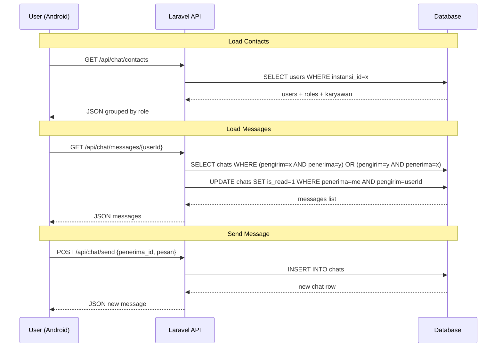

# Rencana Fitur Chat / Daftar Kontak

## 1. Ringkasan Fitur

Mengganti menu "Pesan" (placeholder) di dashboard pemilik dan dashboard karyawan menjadi **Daftar Kontak + Chat** internal UMKM.

**Fitur:**
- Menampilkan daftar kontak dari **satu instansi (UMKM)** yang sama
- Kontak **dikelompokkan berdasarkan role** (Pemilik, Manager, Staff, dll)
- Setiap kontak menampilkan avatar, nama lengkap, role/jabatan
- Ketuk kontak → buka **Chat Detail** (percakapan 1-on-1)
- Chat bersifat **realtime** menggunakan polling atau WebSocket
- Bottom navigation di kedua dashboard tetap menggunakan ikon Email/Pesan

---

## 2. Alur Data & Arsitektur

### Backend (Laravel)

```
User (id, name, email, role_id, instansi_id, outlet_id)
  ↑ belongsTo Role
  ↑ hasOne Karyawan

Karyawan (id, user_id, nama_lengkap, kontak, foto_profil)
  ↑ belongsTo User

Chat (id, pengirim_id, penerima_id, pesan, is_read, created_at, updated_at)
  ↑ pengirim_id → User.id
  ↑ penerima_id → User.id
```

### Frontend (Android)

```
ChatRepository
  → getContacts(instansiId) → List<Contact>
  → getMessages(pengirimId, penerimaId) → List<ChatMessage>
  → sendMessage(pengirimId, penerimaId, pesan) → ChatMessage

ChatViewModel
  → uiState: list kontak + list pesan + loading/error
  
ChatContactListScreen
  → tampilkan kontak per role
  
ChatDetailScreen
  → tampilkan percakapan + input pesan
```

### API Endpoints (Backend)

| Method | Endpoint | Deskripsi |
|--------|----------|-----------|
| GET | `/api/chat/contacts` | Ambil daftar kontak satu instansi |
| GET | `/api/chat/messages/{userId}` | Ambil riwayat chat dengan user tertentu |
| POST | `/api/chat/send` | Kirim pesan ke user tertentu |
| PUT | `/api/chat/read/{userId}` | Tandai pesan sudah dibaca |

---

## 3. Detail Implementasi Backend

### 3.1 Migration: `create_chats_table.php`

```php
Schema::create('chats', function (Blueprint $table) {
    $table->id();
    $table->foreignId('pengirim_id')->constrained('users')->cascadeOnDelete();
    $table->foreignId('penerima_id')->constrained('users')->cascadeOnDelete();
    $table->text('pesan');
    $table->boolean('is_read')->default(false);
    $table->timestamps();
});
```

### 3.2 Model Chat.php

- Fillable: `pengirim_id`, `penerima_id`, `pesan`, `is_read`
- Relationships:
  - `pengirim()` belongsTo User
  - `penerima()` belongsTo User

### 3.3 Model User - tambah relationships

```php
public function profilKaryawan()
{
    return $this->hasOne(Karyawan::class, 'user_id');
}

public function pesanDikirim()
{
    return $this->hasMany(Chat::class, 'pengirim_id');
}

public function pesanDiterima()
{
    return $this->hasMany(Chat::class, 'penerima_id');
}
```

### 3.4 Model Karyawan - tambah relationship ke User

```php
public function user()
{
    return $this->belongsTo(User::class);
}
```

### 3.5 ChatController

#### `GET /api/chat/contacts`
- Auth: Sanctum
- Logic:
  1. Ambil `instansi_id` dari user yang login
  2. Ambil semua user dalam instansi yang sama (termasuk user yang login)
  3. Load `role` dan `profilKaryawan` (nama_lengkap, foto_profil)
  4. Kelompokkan berdasarkan role
  5. Hitung jumlah pesan belum dibaca dari setiap user ke user yang login
  6. Return JSON

#### `GET /api/chat/messages/{userId}`
- Auth: Sanctum
- Logic:
  1. Ambil pesan antara user login dan user target
  2. Urutkan berdasarkan created_at ASC
  3. Tandai semua pesan dari user target ke user login sebagai `is_read = true`
  4. Return JSON

#### `POST /api/chat/send`
- Auth: Sanctum
- Request body: `penerima_id`, `pesan`
- Logic:
  1. Validasi penerima_id ada dan satu instansi
  2. Simpan chat
  3. Return chat yang baru dibuat

### 3.6 Routes `api.php`

```php
Route::middleware('auth:sanctum')->prefix('chat')->group(function () {
    Route::get('/contacts', [ChatController::class, 'contacts']);
    Route::get('/messages/{user}', [ChatController::class, 'messages']);
    Route::post('/send', [ChatController::class, 'send']);
    Route::put('/read/{user}', [ChatController::class, 'markAsRead']);
});
```

---

## 4. Detail Implementasi Frontend

### 4.1 DTOs

**ChatContactResponse.kt**
```kotlin
data class ChatContactResponse(
    val status: String,
    val data: List<ContactGroup>
)

data class ContactGroup(
    val role: String,        // "Pemilik", "Manager", "Staff"
    val contacts: List<ContactDto>
)

data class ContactDto(
    val id: Int,
    val name: String,
    val email: String,
    val role: String,
    val nama_lengkap: String,
    val foto_profil: String?,
    val unread_count: Int,
    val last_message: String?,
    val last_message_time: String?
)
```

**ChatMessageResponse.kt**
```kotlin
data class ChatMessageResponse(
    val status: String,
    val data: List<MessageDto>
)

data class SendMessageRequest(
    val penerima_id: Int,
    val pesan: String
)

data class MessageDto(
    val id: Int,
    val pengirim_id: Int,
    val penerima_id: Int,
    val pesan: String,
    val is_read: Boolean,
    val created_at: String,
    val waktu: String  // format relative
)
```

### 4.2 ApiService - tambah endpoints

```kotlin
@GET("chat/contacts")
suspend fun getChatContacts(): Response<ChatContactResponse>

@GET("chat/messages/{userId}")
suspend fun getChatMessages(
    @Path("userId") userId: Int
): Response<ChatMessageResponse>

@POST("chat/send")
suspend fun sendChatMessage(
    @Body request: SendMessageRequest
): Response<ChatMessageResponse> // atau single message response

@PUT("chat/read/{userId}")
suspend fun markChatRead(
    @Path("userId") userId: Int
): Response<Unit>
```

### 4.3 ChatRepository

```kotlin
interface ChatRepository {
    suspend fun getContacts(): Result<List<ContactGroup>>
    suspend fun getMessages(userId: Int): Result<List<MessageDto>>
    suspend fun sendMessage(penerimaId: Int, pesan: String): Result<MessageDto>
    suspend fun markAsRead(userId: Int): Result<Unit>
}
```

### 4.4 ChatViewModel

**UiState untuk ContactList:**
```kotlin
data class ChatContactUiState(
    val contactGroups: List<ContactGroup> = emptyList(),
    val isLoading: Boolean = false,
    val errorMessage: String? = null
)
```

**UiState untuk ChatDetail:**
```kotlin
data class ChatDetailUiState(
    val messages: List<MessageDto> = emptyList(),
    val isLoading: Boolean = false,
    val errorMessage: String? = null,
    val isSending: Boolean = false,
    val contactName: String = "",
    val contactPhoto: String? = null
)
```

### 4.5 Halaman Contact List (`ChatContactListScreen.kt`)

**Struktur:**
- TopAppBar: "Kontak" atau "Pesan"
- LazyColumn dengan section header per role
  - Misal: "Pemilik (1)", "Manager (2)", "Staff (5)"
- Setiap item:
  - Avatar (lingkaran dengan inisial atau foto)
  - Nama lengkap
  - Role / jabatan
  - Badge unread count (jika ada)
  - Last message preview
- BottomNav sudah di parent screen (Dashboard/DashboardKaryawan)

### 4.6 Halaman Chat Detail (`ChatDetailScreen.kt`)

**Struktur:**
- TopAppBar: Nama kontak + avatar kecil + back button
- LazyColumn untuk pesan (dari bawah ke atas)
  - Bubble chat: kanan = pesan kita, kiri = pesan mereka
  - Waktu di bawah bubble
- Input bar:
  - TextField + Send button (Icons.Default.Send)
- Auto-scroll ke bawah saat pesan baru

### 4.7 Navigation

**Tambahkan di AppNavigation.kt:**
```kotlin
composable("contact_list") {
    ChatContactListScreen(
        onBack = { navController.popBackStack() },
        onContactClick = { userId, userName ->
            navController.navigate("chat_detail/$userId/$userName")
        }
    )
}

composable("chat_detail/{userId}/{userName}") { backStackEntry ->
    val userId = backStackEntry.arguments?.getString("userId")?.toIntOrNull() ?: return@composable
    val userName = backStackEntry.arguments?.getString("userName") ?: "User"
    ChatDetailScreen(
        userId = userId,
        userName = userName,
        onBack = { navController.popBackStack() }
    )
}
```

### 4.8 Update BottomNavigation

**Dashboard Karyawan** (sudah ada menu "Pesan" index 2):
- Ubah navigasi dari `onNavigateTo("pesan")` → `onNavigateTo("contact_list")`

**Dashboard Pemilik** (menu "Pesan" index 2):
- Ubah navigasi dari `onNavigateTo("pesan")` → `onNavigateTo("contact_list")`

### 4.9 DI Module

Tambah di `DataModule.kt`:
```kotlin
single<ChatRepository> { ChatRepositoryImpl(apiService = get()) }
```

Tambah di `ViewModelModule.kt`:
```kotlin
viewModel { ChatContactViewModel(chatRepository = get()) }
viewModel { params -> ChatDetailViewModel(userId = params.get(), chatRepository = get()) }
```

---

## 5. Flow Navigasi

```
Dashboard (Pemilik/Karyawan)
  │
  └── BottomNav "Pesan" → ContactListScreen
                            │
                            └── Ketuk kontak → ChatDetailScreen(userId)
                                                  │
                                                  ├── Kirim pesan → POST /chat/send
                                                  ├── Load pesan → GET /chat/messages/{userId}
                                                  └── Back → ContactListScreen
```

## 6. Urutan Pengerjaan (Prioritas)

1. **Backend: Migration** — Buat tabel `chats`
2. **Backend: Model** — Buat model `Chat.php`, update `User.php` dan `Karyawan.php`
3. **Backend: Controller** — Buat `ChatController` dengan 4 method
4. **Backend: Routes** — Daftarkan route di `api.php`
5. **Frontend: DTOs** — Buat data class untuk request/response
6. **Frontend: ApiService** — Tambah endpoint Retrofit
7. **Frontend: Repository** — Buat interface + impl
8. **Frontend: ViewModels** — Buat ChatContactViewModel, ChatDetailViewModel
9. **Frontend: UI Screens** — Buat ContactListScreen + ChatDetailScreen
10. **Frontend: Navigation & DI** — Daftarkan route + module
11. **Frontend: Update BottomNav** — Ubah placeholder "Pesan" ke contact_list

---

## 7. Diagram Alur Data



---

## 8. Catatan Tambahan

- **Realtime:** Untuk tahap awal menggunakan **polling** (refresh setiap 5-10 detik) di ChatDetailScreen. WebSocket bisa diimplementasikan nanti.
- **Foto Profil:** Gunakan lingkaran dengan inisial jika foto profil tidak tersedia.
- **Unread Badge:** Tampilkan jumlah pesan belum dibaca di setiap kontak.
- **Scroll Chat:** LazyColumn menggunakan `reverseLayout = true` agar otomatis scroll ke bawah.
- **Keamanan:** Pastikan user hanya bisa chat dengan user dalam instansi yang sama (validasi di backend).
